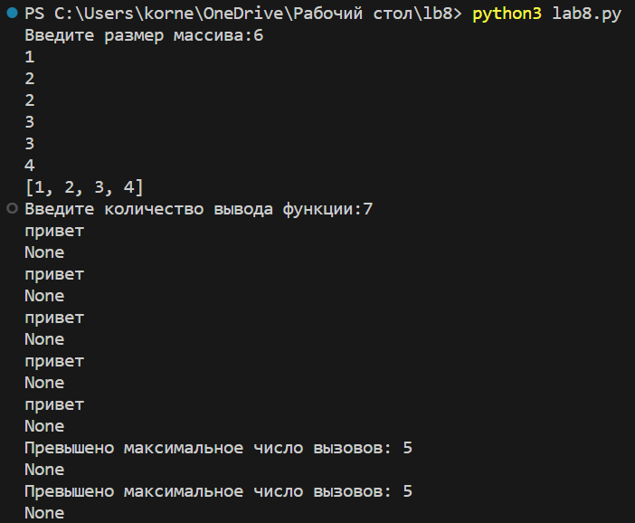

# Лабораторная работа №8.
## Замыкания
### Задание
1. Решите обе задачи своего варианта.
2. Примените декоратор к замыканию. 

    Замыкание, отбирающее только уникальные значения из переданных.

    Декоратор, который будет ограничивать количество вызовов функций.

```python
# 1) Замыкание, отбирающее только уникальные значения из переданных:

def unique_values(func):
    def wrapper(*args, **kwargs):
        values = func(*args, **kwargs)
        return list(set(values))

    return wrapper

@unique_values
def get_values():
    return a

a = []
n = int (input ("Введите размер массива:"))
for i in range (n):
    a.append (int (input ()))

print(get_values())


# 2) Декоратор, ограничивающий количество вызовов функции:

def limit_calls(max_calls):
    def decorator(func):
        def wrapper(*args, **kwargs):
            if wrapper.counter < max_calls:
                wrapper.counter += 1
                return func(*args, **kwargs)
            else:
                print(f'Превышено максимальное число вызовов: {max_calls}')
        wrapper.counter = 0
        return wrapper
    return decorator


#Для использования этого декоратора, вы можете применить его к любой функции, указав максимальное число вызовов в качестве аргумента:
@limit_calls(max_calls=5)
def my_function():
    print("привет")

a = int(input())
while a > 0:
    print(my_function())
    a -= 1
```
### Результат программы
